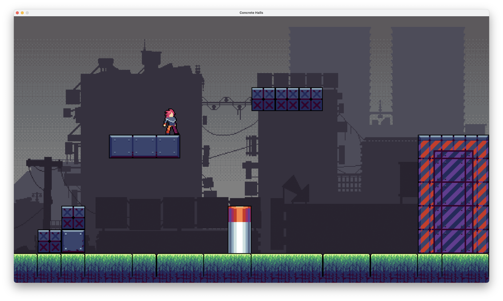

# Concrete Halls: A Game on Zephyr
We are proud to present the Zephyr Game Engine, an easy-to-use game development
  framework for OCaml. Harnessing the power of the popular SDL2 graphics library
  and the beauty of OCaml programming, Zephyr makes it easy to design custom levels
  with different obstacles, taking advantage of features such as animated sprites,
  advanced collision physics, tilemaps, and optimized texture loading.

  As a demonstration of the power of Zephyr, we are also presenting Concrete Halls,
  a cyberpunk 2D side-scrolling game based on a thrilling storyline. Concrete
  Halls takes advantage of the ease of level creation provided by the Zephyr
  engine and includes a total of 15 custom platforming levels, as well as a
  cutscene after the main menu. Concrete Halls serves to demonstrate that Zephyr's
  custom types and functions are extremely easy to work with in order to produce
  a custom 2D game.
 
## Luis Hernández Rocha (lh555), Tawakalt Bisola Okunola (tbo8), Pedro Pontes García (pp457)
